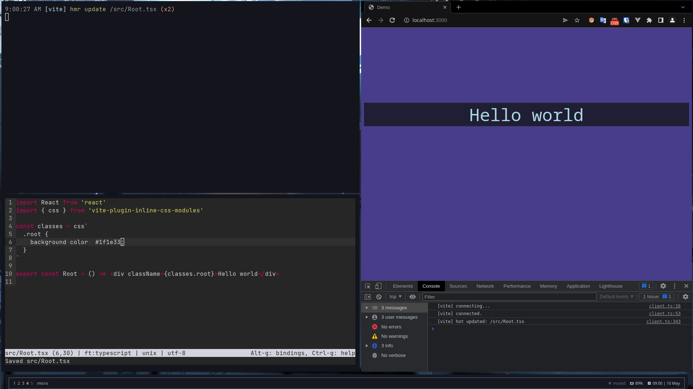

# React demo

```jsx
import React from 'react'
import { css } from 'vite-plugin-inline-css-modules'

const classes = css`
  .root {
    background-color: #1f1e33;
  }
`

export const Root = () => <div className={classes.root}>Hello world</div>
```

Preview


